# Variational Loss of Random Sampling for Searching Cluster Number

This is the code of paper `Variational Loss of Random Sampling for Searching Cluster Number` 

There are four main entries for Random Sampling Likelihood Clustering (RSLC) algorithm:

## RSLC_demo.py

The first version of RSLC. Using K-means on double-samples and merging two losses to a final loss value.

Dependencies：

- pylab
- numpy
- scipy
- sklearn

Parameters：

- `k_min`：The least cluster numbers (defaultly set to 2)
- `k_max`：The max cluster numbers to limit unnecessary searching

## RSLC_sigma.py

Determine the number of clusters on only one random sampling sub-dataset.

Dependencies：

- matplotlib
- pylab
- numpy
- sklearn
- tqdm

Parameters：

- `k_min`：The least cluster numbers (defaultly set to 2)
- `k_max`：The max cluster numbers to limit unnecessary searching
- `proportion`：The random sampling size

## RSLC_var.py

The RSLC algorithm in paper. Parameters are packed in main function and the Var-GMM version is implemented.

Dependencies：

- numpy
- pylab
- scipy
- sklearn
- tqdm
- afkmc2

Parameters：

- `k_min`：The least cluster numbers (defaultly set to 2)
- `k_max`：The max cluster numbers to limit unnecessary searching
- `near_num`：The searching number of nearest points 
- `proportion`：The random sampling size
- `max_iteration_times`：The parameter for K-means
- `iter_avg`：The iteration times for testing
- `algorithm`：The selection of algorithms

## RSLCT.py

The RSLCT algorithm in paper.

Dependencies：

- matplotlib
- numpy
- pylab
- scipy
- sklearn
- tqdm
- afkmc2

Parameters：

- `k_min`：The least cluster numbers (defaultly set to 2)
- `k_max`：The max cluster numbers to limit unnecessary searching
- `near_num`：The searching number of nearest points 
- `proportion`：The random sampling size
- `max_iteration_times`：The parameter for K-means
- `iter_avg`：The iteration times for testing
- `algorithm`：The selection of algorithms

- `is_transformed`：Use RSLCT or RSLC (True for RSLCT)

# Transform

## Transforming of `r15` dataset

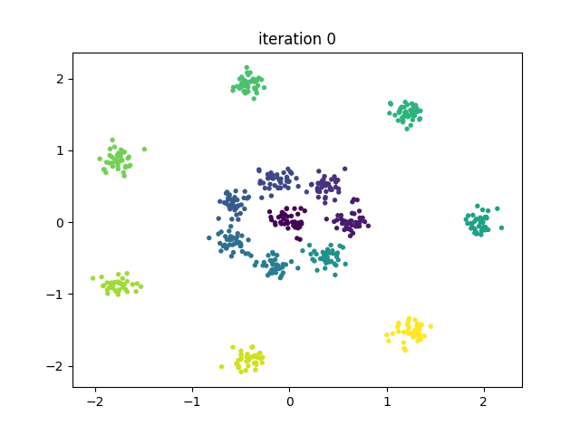 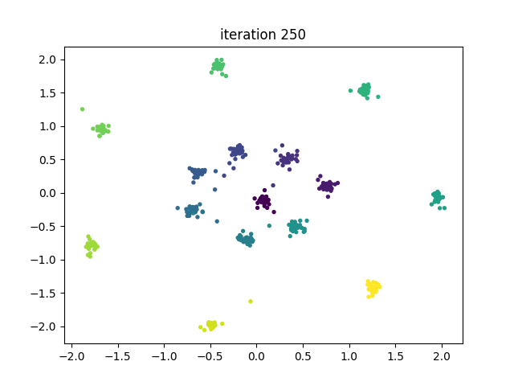 

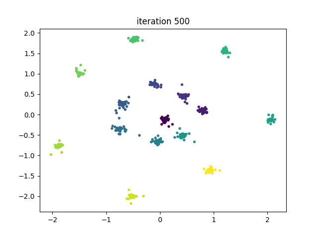 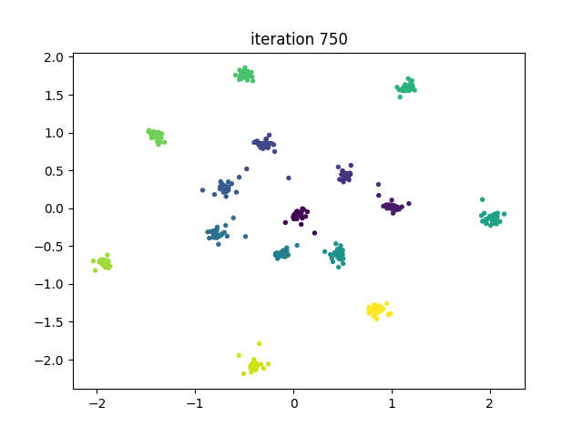 

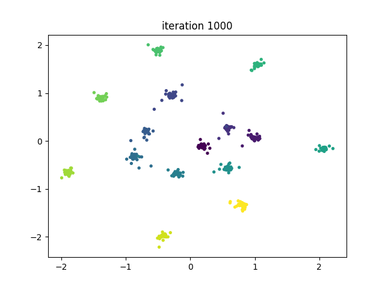 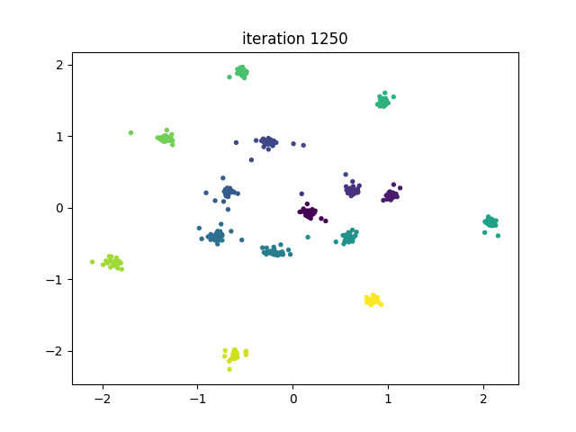 

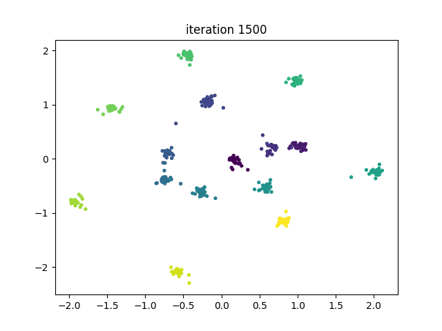 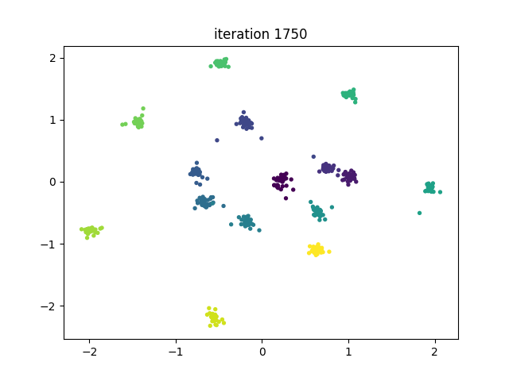 

The transforming does not destroy the Gaussian distribution

## Transforming of `flame` dataset

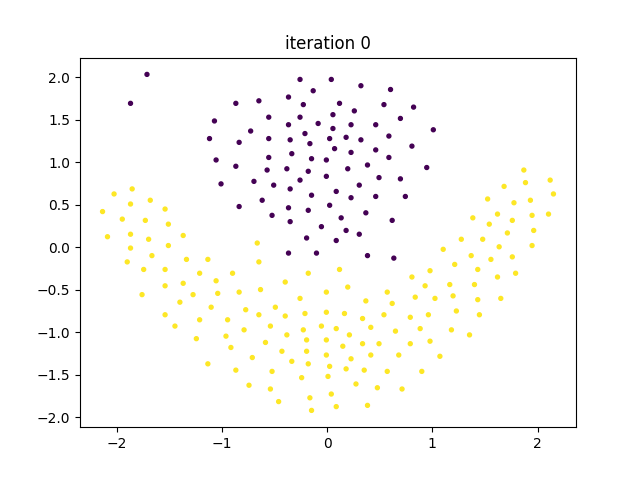 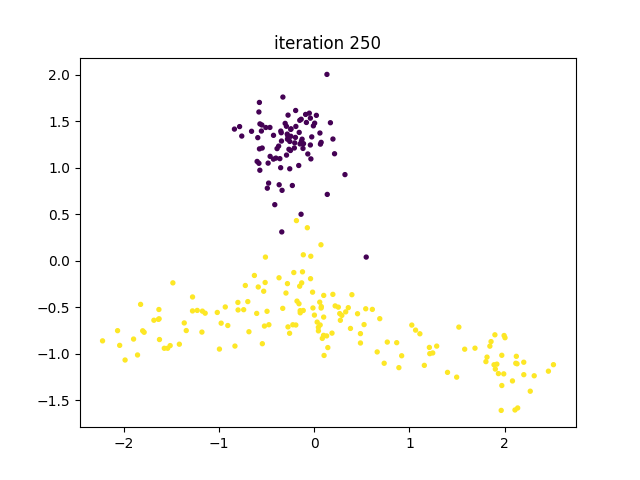 

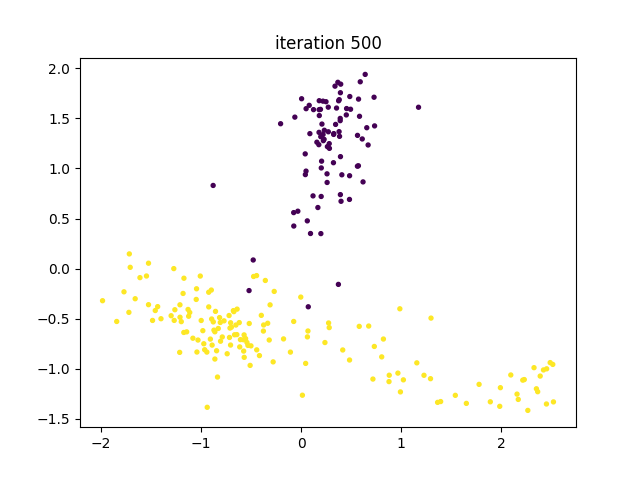 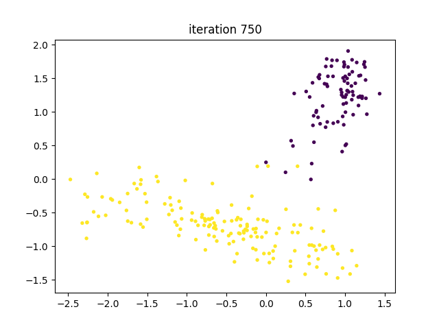 

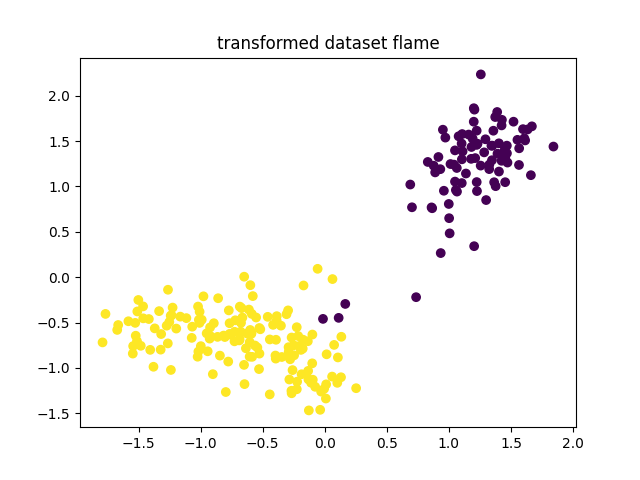

The transforming does gather points to a more Gaussian-like distribution.

